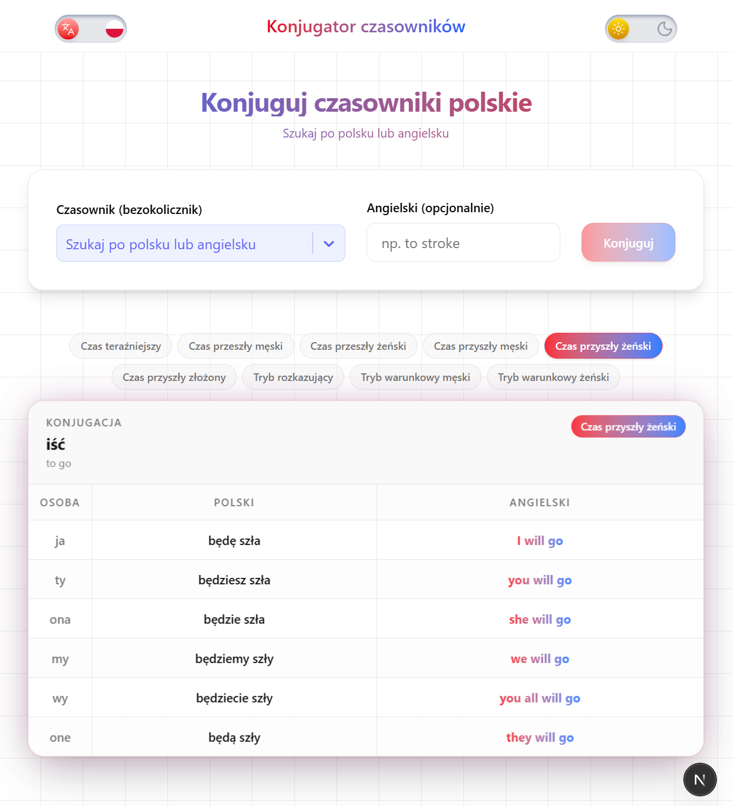

# Polish Verb Conjugator (Morpheus)

Educational Polish verb conjugator with a Python backend powered by **Morfeusz2** and a Next.js frontend. Enter a Polish verb infinitive and get full conjugations across all tenses, with English translations.



---

## Opening in Cursor / VS Code

**Use the workspace file** so you get a single Source Control view (no duplicate "morpheus" and "frontend" sections):

- **File → Open Workspace from File...** → select `morpheus.code-workspace`

Or double-click `morpheus.code-workspace` in Explorer. The `frontend` folder appears as a subfolder under Morpheus.

---

## Quick Start

**1. Backend (Python API)**

```bash
pip install -r requirements.txt
python -m uvicorn api.main:app --reload --port 8000
```

**2. Frontend (Next.js)** — in a separate terminal

```bash
cd frontend
npm install
npm run dev
```

- **Frontend:** http://localhost:3000  
- **API:** http://localhost:8000  

---

## Python Implementation

### Morfeusz2 and the SGJP Dictionary

The conjugation engine is built on **[Morfeusz2](https://github.com/morfeuszpl/morfeusz)** (v1.99+), a morphological analyzer and generator for Polish. Morfeusz2 uses the **SGJP** (Słownik gramatyczny języka polskiego) dictionary, which provides inflected forms for Polish lemmas.

**Installation:**

```bash
pip install morfeusz2
```

Morfeusz2 exposes a `generate(lemma)` method that returns all inflected forms for a given lemma. Each result is a tuple `(form, lemma_id, tag)`, where `tag` is a colon-separated SGJP tag describing the grammatical form.

### SGJP Tag Structure

Tags follow the pattern `category:number:person:aspect` (or similar). Key components:

| Tag part | Meaning | Example |
|----------|---------|---------|
| `fin` | Finite (present/future) | `fin:sg:pri:imperf` = 1st person singular present |
| `praet` | Past tense (3rd person only in SGJP) | `praet:sg:m1.m2.m3:imperf` = masculine singular past |
| `impt` | Imperative | `impt:sg:sec:imperf` = 2nd person singular imperative |
| `inf` | Infinitive | `inf:imperf` |
| `sg` / `pl` | Singular / plural | |
| `pri` / `sec` / `ter` | 1st / 2nd / 3rd person | |
| `m1` / `m2` / `m3` / `f` / `n` | Masculine / feminine / neuter | |
| `imperf` / `perf` | Imperfective / perfective (aspect) | |

### Core Flow: Querying Morfeusz2

```python
import morfeusz2

morf = morfeusz2.Morfeusz(dict_name="sgjp")
results = morf.generate("gładzić")  # Returns list of (form, lemma_id, tag)

# Example output for "gładzić":
# [("gładzę", "gładzić", "fin:sg:pri:imperf:nul"),
#  ("gładzisz", "gładzić", "fin:sg:sec:imperf:nul"),
#  ("gładził", "gładzić", "praet:sg:m1.m2.m3:imperf:nul"),
#  ...]
```

### Extracting Forms by Tag

The conjugator filters results by tag and maps them to logical keys:

```python
def _get_forms_by_tag(morf, lemma):
    results = morf.generate(lemma)
    by_tag = {}
    for item in results:
        form, _, tag = item
        parts = tag.split(":")
        if "fin" in parts or "praet" in parts or "impt" in parts or "inf" in parts:
            by_tag.setdefault(tag, []).append((form, tag))
    return by_tag

# Maps tags like "fin:sg:pri:imperf" -> "fin_sg_pri" = "gładzę"
```

### Deriving 1st/2nd Person Past and Conditional

**SGJP only provides 3rd-person past forms** (on, ona, ono, oni, one). The conjugator derives 1st and 2nd person by extracting the stem and applying suffix rules.

**Step 1: Extract stems from 3rd-person forms**

```python
def _derive_past_stems(extracted: dict[str, str]) -> dict[str, str]:
    stems = {}
    # Masculine singular: gładził -> stem gładzi-
    if "praet_sg_m" in extracted:
        m = extracted["praet_sg_m"]
        stems["masc_sg"] = m[:-1] if m.endswith("ł") else m  # remove -ł
    # Feminine singular: gładziła -> stem gładzi-
    if "praet_sg_f" in extracted:
        f = extracted["praet_sg_f"]
        stems["fem_sg"] = f[:-2] if f.endswith("ła") else f  # remove -ła
    # Masculine plural: gładzili -> stem gładzi-
    if "praet_pl_m" in extracted:
        m = extracted["praet_pl_m"]
        stems["masc_pl"] = m[:-2] if m.endswith("li") else m
    # Feminine plural: gładziły -> stem gładzi-
    if "praet_pl_f" in extracted:
        f = extracted["praet_pl_f"]
        stems["fem_pl"] = f[:-2] if f.endswith("ły") else f
    return stems
```

**Step 2: Build full past blocks**

```python
def _build_past_forms(extracted, stems):
    masc_sg = stems.get("masc_sg", "")
    masc_pl = stems.get("masc_pl", masc_sg)
    fem_sg = stems.get("fem_sg", "")
    fem_pl = stems.get("fem_pl", fem_sg)
    # Masculine: stem + -łem/-łeś/-ł/-liśmy/-liście/-li
    past_masc["past_ja_masc"] = f"{masc_sg}łem"   # gładziłem
    past_masc["past_ty_masc"] = f"{masc_sg}łeś"   # gładziłeś
    past_masc["past_on_masc"] = extracted.get("praet_sg_m", "-")  # gładził (from SGJP)
    past_masc["past_my_masc"] = f"{masc_pl}liśmy" # gładziliśmy
    past_masc["past_wy_masc"] = f"{masc_pl}liście"
    past_masc["past_oni_masc"] = extracted.get("praet_pl_m", "-")
    # Feminine: stem + -łam/-łaś/-ła/-łyśmy/-łyście/-ły
    past_fem["past_ja_fem"] = f"{fem_sg}łam"
    past_fem["past_ty_fem"] = f"{fem_sg}łaś"
    past_fem["past_ona_fem"] = extracted.get("praet_sg_f", "-")
    past_fem["past_my_fem"] = f"{fem_pl}łyśmy"
    past_fem["past_wy_fem"] = f"{fem_pl}łyście"
    past_fem["past_one_fem"] = extracted.get("praet_pl_f", "-")
```

### Conditional Forms

The conditional is **not in SGJP**. It is built from the past stem + conditional suffix:

```python
# Masculine: stem + łbym/łbyś/łby/libyśmy/libyście/liby
cond_masc["conditional_masculine_ja"] = f"{masc_sg}łbym"   # gładziłbym
cond_masc["conditional_masculine_ty"] = f"{masc_sg}łbyś"  # gładziłbyś
cond_masc["conditional_masculine_on"] = f"{masc_sg}łby"
cond_masc["conditional_masculine_my"] = f"{masc_pl}libyśmy"
cond_masc["conditional_masculine_wy"] = f"{masc_pl}libyście"
cond_masc["conditional_masculine_oni"] = f"{masc_pl}liby"

# Feminine: stem + łabym/łabyś/łaby/łybyśmy/łybyście/łyby
cond_fem["conditional_feminine_ja"] = f"{fem_sg}łabym"
# ...
```

### Main Entry Point

```python
from conjugator import generate_conjugation

# Full conjugation with English translations
data = generate_conjugation("gładzić", "to stroke")

# Returns dict with: present, past_masc, past_fem, future_masc, future_fem,
# imp_future, imperative, conditional_masculine, conditional_feminine
# Each block has Polish forms + _trans fields for English
```

### CLI Usage

```bash
python -m conjugator --verb gładzić --english "to stroke"
python -m conjugator -v iść -e "to go" --aspect niedokonany
python -m conjugator -v robić -c  # compact JSON
```

### English Translation Pipeline

1. **Local dictionary** — `data/pl_verb_translations.json` (3k+ verbs, offline)
2. **MyMemory API fallback** — For verbs not in the dictionary

```python
from api.translator import translate_pl_to_en

translate_pl_to_en("gładzić")  # -> "to stroke"
translate_pl_to_en("znąć")    # -> "to know" (from API if not in dict)
```

### Aspect Detection

Aspect (imperfective vs perfective) is inferred from SGJP tags:

```python
# imperf in tag -> "Niedokonany"
# perf in tag -> "Dokonany"
```

---

## FastAPI Backend

The REST API wraps the conjugator and translator:

```python
# api/main.py
from conjugator import generate_conjugation
from api.translator import translate_pl_to_en

@app.get("/api/conjugate")
async def conjugate(
    verb: str = Query(...),
    english: str | None = Query(None),
    aspect: str | None = Query(None),
) -> dict:
    # If english not provided, fetch via MyMemory or local dict
    if english_val is None:
        english_val = translate_pl_to_en(verb_clean)
    data = generate_conjugation(verb_clean, english_val, aspect)
    return data
```

**Endpoints:**

| Endpoint | Description |
|----------|-------------|
| `GET /api/conjugate?verb={infinitive}&english={optional}&aspect={optional}` | Full conjugation JSON |
| `GET /api/verbs` | Polish → English verb dictionary (for dropdown) |
| `GET /health` | Health check |

---

## Next.js Frontend

The frontend is a React app built with Next.js 16, Tailwind CSS, and react-i18next for bilingual support (English/Polish).

### Features

- **Verb search** — CreatableSelect with 3k+ verbs from the API
- **Conjugation carousel** — Auto-rotates every 3 seconds with 2-second fade transitions; clickable tense pills
- **Bilingual UI** — EN/PL toggle with flag images; tense labels in both languages
- **Dark/light mode** — Theme switcher

### API Integration

```typescript
// frontend/src/lib/api.ts
const API_BASE = process.env.NEXT_PUBLIC_API_URL || "http://localhost:8000";

export async function fetchConjugation(params: ConjugateParams): Promise<unknown> {
  const url = new URL(`${API_BASE}/api/conjugate`);
  url.searchParams.set("verb", params.verb.trim());
  if (params.english) url.searchParams.set("english", params.english);
  if (params.aspect) url.searchParams.set("aspect", params.aspect);
  const res = await fetch(url.toString());
  return res.json();
}
```

### Project Structure

| Path | Description |
|------|-------------|
| `conjugator.py` | Core conjugation logic using Morfeusz2 |
| `api/main.py` | FastAPI REST backend |
| `api/translator.py` | Polish → English translation (local + MyMemory) |
| `frontend/` | Next.js React app |
| `data/pl_verb_translations.json` | Polish → English verb dictionary (3k+ verbs) |

---

## Refreshing the Verb Dictionary

To rebuild the local dictionary from Wiktionary (via kaikki.org):

```bash
python scripts/build_verb_dictionary.py          # merge with existing
python scripts/build_verb_dictionary.py --replace # fresh extract
```

---

## Environment (optional)

Create `frontend/.env.local` to override the API URL (e.g. for production):

```
NEXT_PUBLIC_API_URL=https://your-api-url.com
```
